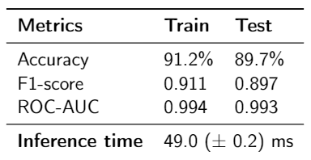
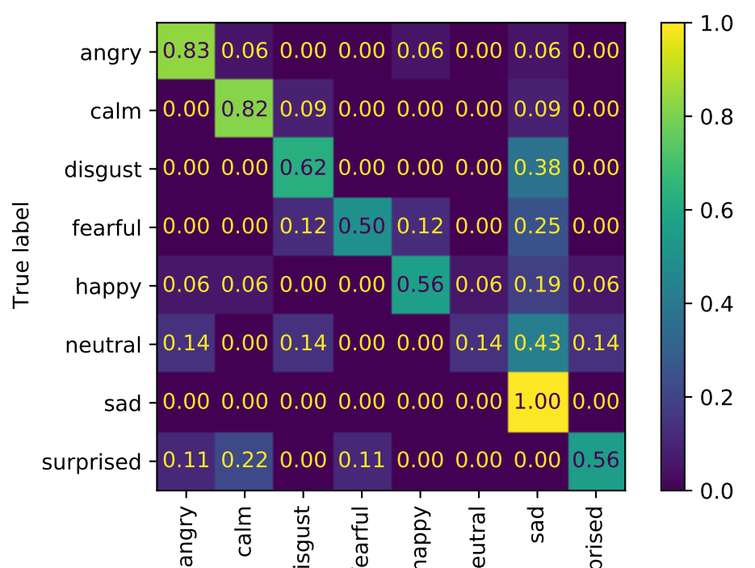

# Emotion recognition in English speech

## Motivation

I did this project in order to learn how to work with audio, transformers and pretrained models. The concept of emotion is not strictly defined from the point of view of science, so you should not take this model seriously. Most likely, it works no better than a polygraph or physiognomy (this is pseudoscience). 
Keep this in mind and have fun. 

## Installation

To install on package on **Windows** use 
```pip install . -f https://download.pytorch.org/whl/torch_stable.html```

To install on package on **Linux** use 
```pip install .```

To run the bot, it should be passed the following environment variables:

- ```BOT_TOKEN``` - bot token (from @BotFatherBot)

- ```COLLECT_PATH``` - path to collect voice

- ```LOGS_FILE``` - path to log errors

- ```TEMP_PATH``` - 

- ```RES_FILE``` - path to the log file to save the name and emotion 

- ```MODEL_PATH``` - saved pre-trained model with classification head *(Any of [this checkpoints](https://drive.google.com/file/d/12t4LwpZosjgvOqMdoQddeY_Xf-bIM4cd/view?usp=sharing))*

- ```HF_MODEL``` - pre-trained model from Huggingface for processor *("jonatasgrosman/wav2vec2-large-xlsr-53-english")*


## Model
(Training process based on [this notebook](https://colab.research.google.com/github/m3hrdadfi/soxan/blob/main/notebooks/Emotion_recognition_in_Greek_speech_using_Wav2Vec2.ipynb#scrollTo=sp37lZOV2042))

The model consists of pre-trained XLSR-Wav2Vec body and classification head. First, the classifier was trained on clear [RAVDESS](https://smartlaboratory.org/ravdess/) dataset (wav2vec weights have been frozen), then the entire model was trained on the same data with added random noise. 

<!--  -->

<!--
<figure>
  
  <figcaption>RAVDESS test dataset results</figcaption>
</figure>
-->

*(Model training notebook will be added soon)*

## Emotion recognition bot

Bot was made for testing model on Russian speech (or English with Russian accent :) ). It collected some data (from my friends with their permission) for testing. 

<!--  -->

<figure>
  
  <figcaption>TOP-2 confussion matrix</figcaption>
</figure>

**TOP-1 accuracy: 47%**

**TOP-2 accuracy: 67%**


